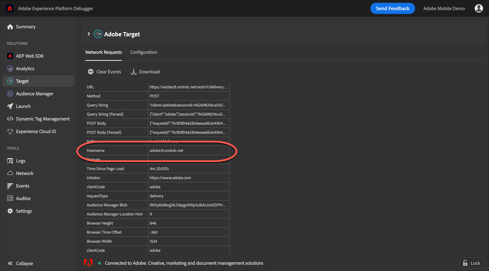

# Use an Analytics tracking server{#use-an-analytics-tracking-server}

If you are using an older version of at.js or mbox.js, you must specify an analytics tracking server for activities that use [!DNL Analytics] for [!DNL Target] (A4T).

>[!NOTE]
>
>If you use [!DNL Analytics] as your activity's reporting source, you do not need to specify a tracking server during activity creation if you are using mbox.js version 61 (or later) or at.js version 0.9.1 (or later). The mbox.js or at.js library automatically sends tracking server values to [!DNL Target]. During activity creation, you can leave the [!UICONTROL Tracking Server] field empty on the [!UICONTROL Goals & Settings] page.
>
>The [!DNL Target] team supports both at.js 1.*x* and at.js 2.*x*. Please upgrade to the most recent update of either major version of at.js to ensure that you are running a supported version. For more information, see [at.js version details](/help/c-implementing-target/c-implementing-target-for-client-side-web/target-atjs-versions.md).

To ensure that data from [!DNL Target] goes to the correct location in [!DNL Analytics], A4T requires an analytics tracking server to be sent in all calls to Modstats from [!DNL Target]. For implementations using multiple tracking servers you can use the [!DNL Adobe Experience Platform Debugger] or your browser's Developer Tools to determine the correct tracking server for your activity.

## Get the analytics tracking server using the Adobe Experience Platform Debugger

The debugger should be viewed on a page where the activity will be delivered to ensure you select the correct tracking server. You can also specify a default tracking server for each account. Contact Customer Care to specify or modify the default.

1. From the page on which you are creating your activity, open the [!DNL Adobe Experience Platform Debugger].

   If you have not installed the debugger, see [Introduction to the Adobe Experience Platform Debugger](https://docs.adobe.com/content/help/en/platform-learn/tutorials/data-ingestion/web-sdk/introduction-to-the-experience-platform-debugger.html).

   

1. Click **[!UICONTROL Analytics]** in the left navigation menu.

   The analytics tracking server is found in the [!UICONTROL Hostname] section of the debugger.

   * **First-party tracking server**: If the hostname of the request matches the domain you are on, then it’s a first-party tracking server. For example, if you are on `adobe.com`, `adobe.com` is the first-party tracking server.
   * **Third-party tracking server**: A third-party tracking server is typically `[company].sc.omtrdc.net` where the company is the name of your company, but always ends in `sc.omtrdc.net`.
   * **CNAME implementations**: `sstats.adobe.com` is an example of a CNAME first-party tracking server for an https (secure) request. `stats.adobe.com` is an example of a CNAME first-party request for an http (non-secure) page.

1. Copy the entire contents of the field.

1. In the **[!UICONTROL Reporting Settings]** section of the **[!UICONTROL Goal & Settings]** screen of your activity, paste the tracking server information in the **[!UICONTROL Tracking Server]** field.

   >[!NOTE]
   >
   >You must select [!UICONTROL Analytics as the Reporting Source] for your activity for the [!UICONTROL Tracking Server] field to be available.

## Get the analytics tracking server using your browser's Developer Tools

The Developer Tools should be viewed on a page where the activity will be delivered to ensure you select the correct tracking server. You can also specify a default tracking server for each account. Contact Customer Care to specify or modify the default.

1. From the page on which you are creating your activity, open the browser's Developer Tools (in Google Chrome, click the three vertical ellipses in the top-right corner > More Tools > Developer Tools).

   

1. Click the **[!UICONTROL Network]** tab.

1. Filter for `/ss,` to display the analytics requests.

   

   The tracking server is the hostname of the request.

   * **First-party tracking server**: If the hostname of the request matches the domain you are on, then it’s a first-party tracking server. For example, if you are on `adobe.com`, `adobe.com` is the first-party tracking server.
   * **Third-party tracking server**: A third-party tracking server is typically `[company].sc.omtrdc.net` where the company is the name of your company, but always ends in `sc.omtrdc.net`.
   * **CNAME implementations**: `sstats.adobe.com` is an example of a CNAME first-party tracking server for an https (secure) request. `stats.adobe.com` is an example of a CNAME first-party request for an http (non-secure) page.

1. Copy the entire contents of the field.

1. In the **[!UICONTROL Reporting Settings]** section of the **[!UICONTROL Goal & Settings]** screen of your activity, paste the tracking server information in the **[!UICONTROL Tracking Server]** field.

   >[!NOTE]
   >
   >You must select [!UICONTROL Analytics as the Reporting Source] for your activity for the [!UICONTROL Tracking Server] field to be available.

